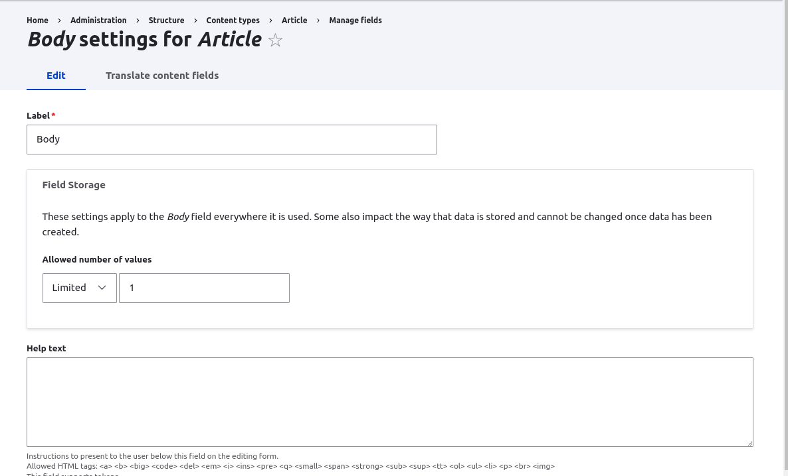
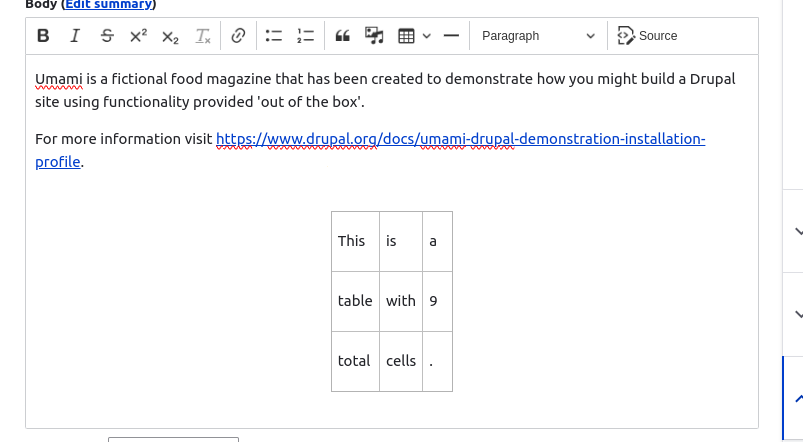
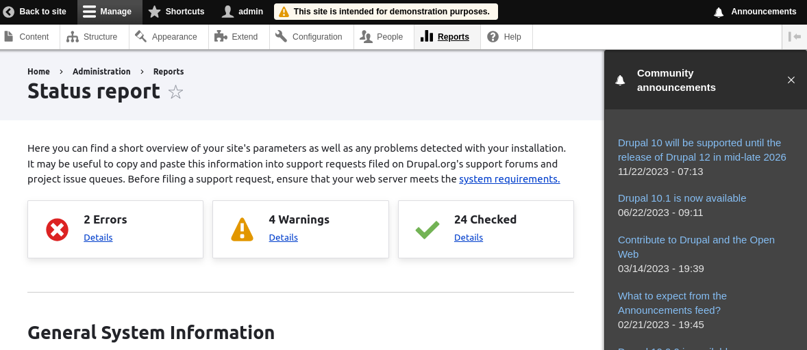
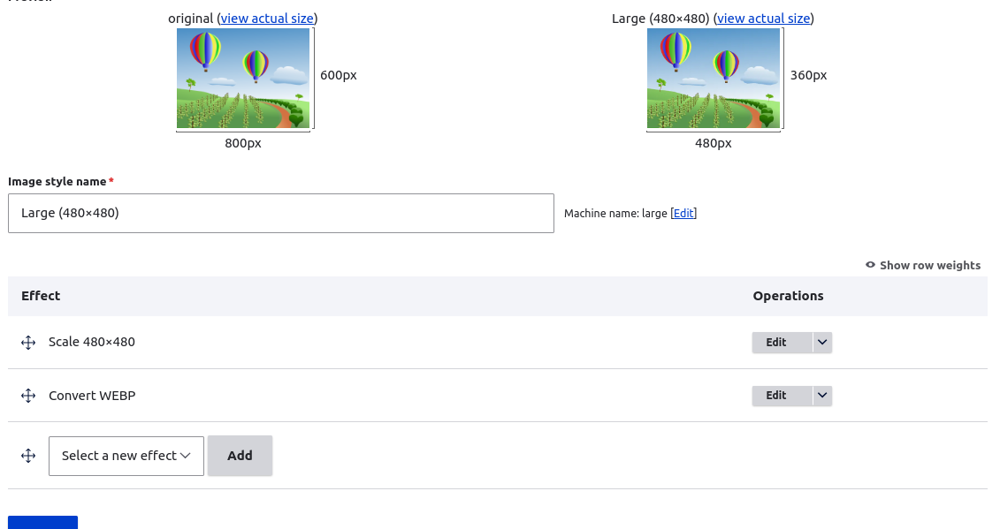

# New Features In<br>Drupal 10.3.0

<!-- Live demos abound! Wish me luck! -->
---

## Drupal 10.3.0 Is A Minor Release

- This is a minor release and so should not break backwards compatibility.
- You should still test your sites though!

---


# Interface Improvements

---

## Field Storage Form

The field storage form is now a sub form of the field configuration form.



---

# CKEditor 5 Improvements

---

## Tables

New formatting for tables and table cells when used with full HTML text formats.



---

# Code Improvements

---

## Controller Auto-wiring

- Controllers no longer require a create() method to inject dependencies. Services are interred from the interfaces in the constructor alone.
- If this is not possible then the `#[Autowire]` attribute can be used to specify the service.

```php
  public function __construct(
    #[Autowire(service: 'cache.default')]
    protected CacheBackendInterface $cache
 ) {}
 ```

--- 

## Filter System Now Outputs HTML5

Previously, the filtering system output XHTML.

Before:
```html
<p>
  Example text
  <br />
  
</p>
```

---

After:
```html
<p>
  Example text
  <br>
  
</p>
```

- In most cases this shouldn't have any effect.
- Anything looking for very specific XHTML output may need to be updated.

---

## Configuration Targets Can Now Be Set

Inform Drupal to use a config item as the `#default_value` without setting it.

```php
   $form['registration_cancellation']['user_email_verification'] = [
      '#type' => 'checkbox',
      '#title' => $this->t('Require email verification when a visitor creates an account'),
      '#config_target' => 'user.settings:verify_mail',
    ];
```

<!-- 
- Part of the new config validation system.
- The form must pass through the parent buildForm() method for this to work.
-->

---

## DeprecationHelper

New class to aid modules supporting multiple versions of core.

```php
$result = DeprecationHelper::backwardsCompatibleCall(
        currentVersion: \Drupal::VERSION,
        deprecatedVersion: '10.3',
        currentCallable: fn() => Role::loadMultiple(),
        deprecatedCallable: fn() => user_roles(),
);
```

<!-- 
- If the current version of Drupal is below 10.3 then run user_roles().
- If the current version of Drupal is 10.3 or above then run Role::loadMultiple().
-->

---

## Schema Strictly Validated In Tests

- Assures that your configuration schema is valid when running tests.
- May cause some modules to start throwing errors during tests when they previously didn't.
- Effects kernel and functional tests.

---
<!-- _footer: "" -->

## Collection Permission

<p class="small-text">Entities may provide a collection_permission to access the entity overview list.</p>

```php
/**
 * @ContentEntityType(
 *   ...
 *   handlers = {
 *     "list_builder" = "Drupal\my_awesome_module\MyAwesomeListBuilder",
 *   ...
 *   },
 *   links = {
 *     "collection" = "/admin/structure/my-awesome-entities",
 *   },
 *   admin_permission = "administer my awesome entities",
 *   collection_permission = "access the awesome entity overview",
```

---


# Experimental Module Changes

---

## Announcements Feed

Promoted to stable.



---


## Experimental Help Topics

Merged into the help module.


---

# Permission Changes

---

## Rebuild Node Permissions

- This action now requires the `administer nodes` permission.
- Previously, only the `access administration pages` option was required.

---

# Performance Improvements

---
<!-- _footer: '' -->
## VariationCache API

- The VariationCache module has been moved into core.
- Allows you to use cache contexts with any cache backend.

```php
$cacheable_metadata = CacheableMetadata::createFromObject($response->getCacheableMetadata());
$this->cache->set(
  ['response'],
  $response,
  $cacheable_metadata->addCacheContexts($this->cacheContexts),
  (new CacheableMetadata())->setCacheContexts($this->cacheContexts)
);
```

- The Group module uses VariationCache.

---

## webp Images

- webp image support is now in core.
- Drupal core shipped image styles will now convert to webp.



---

## content-length Header

- Drupal now sets a content-length header for most responses.
- This includes all non-streamed responses (so, anything not using BigPipe).
- Allows services implementing `DestructableInterface` to run after the page has been delivered to the client.
- May need to enable output buffering by default in PHP.

---

## PHP Fibers

- Big Pipe rendering now makes use of PHP Fibers.
- Read more: [#! Code : Fibers In PHP 8.1](https://www.hashbangcode.com/article/fibers-php-81)

---

# And Finally...

---

## PHP Version

Drupal now supports PHP 8.3 and recommends at least PHP 8.2.

---

## Symfony Components

Symfony components have been updated to version 6.4.

---

## Symfony Mailer

- The Symfony Mailer component has been added to Drupal core.
- The ultimate aim is to replace the existing mail system in a future release.

---

## Upgrading From Drupal 9

- Make sure you update to Drupal 9.4.4 before updating to Drupal 10.

- Remember that Drupal 9 is currently end of life and will receive no security updates.

---

## Resources

[Drupal 10.3.0](https://www.drupal.org/project/drupal/releases/10.3.0)
