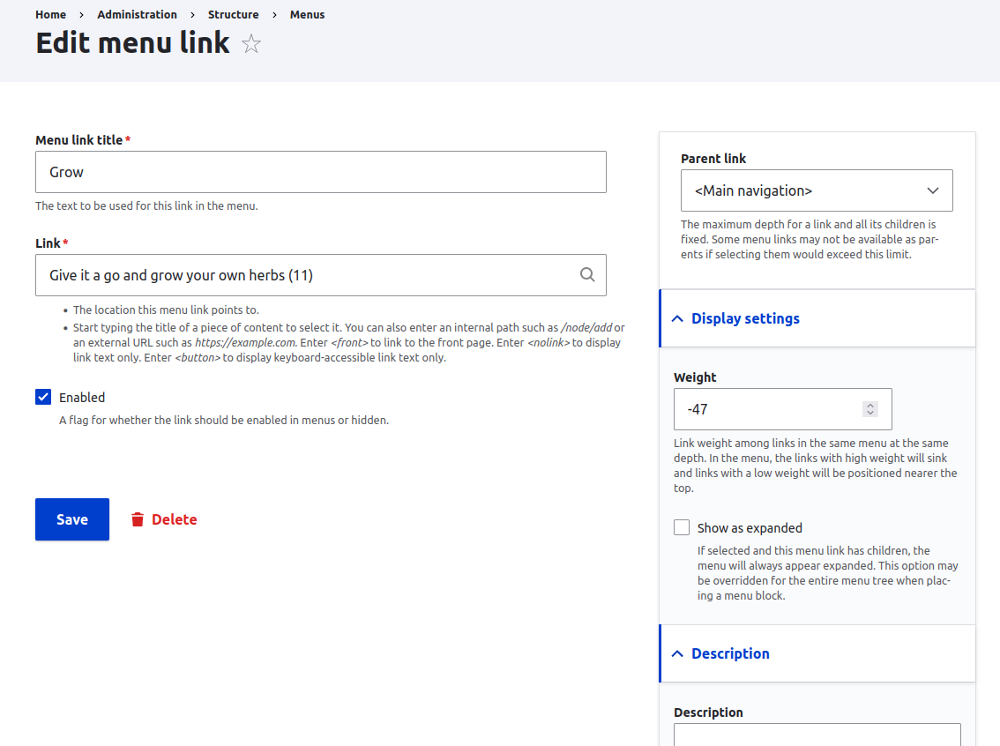

# New Features In Drupal 10.3.0

<!-- Live demos abound! Wish me luck! -->
---

## Drupal 10.3.0 Is A Minor Release

- This is a minor release and so should not break backwards compatibility.
- You should still test your sites though!

---

# Navigation

---

## Navigation Modules

New experimental navigation modules.

Navigation Top Bar has some bugs currently.

---

## Navigation Modules

Typical Drupal cusomisation options are available.

---

## Menu Link Interface

Options moved into the right menu.

---

## Taxonomy Revisions

Now usable.

---

## Workspace Module

Now stable!

---

## Single-Directory Components

Now stable and moved into core.

---

# Recipes And Install Profiles

---

## Recipes

Now in core.

Used as part of the [startshot initative](https://github.com/phenaproxima/starshot-prototype).

---

## Install Profiles

No longer required.

Can be uninstalled.

---

## Access Policy API

Provides a flexible access system that goes beyond roles and permissions.

---

## Resources

[Drupal 10.3.0](https://www.drupal.org/project/drupal/releases/10.3.0)
